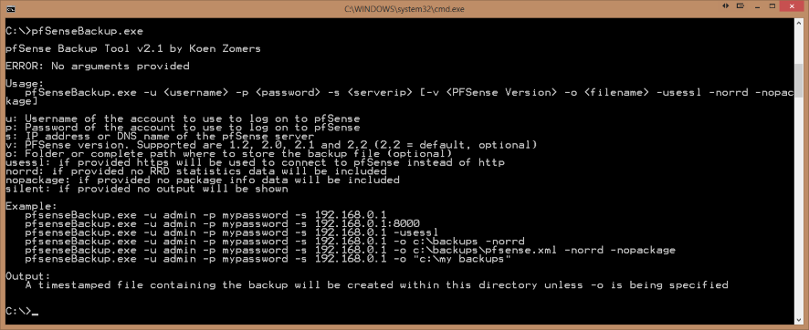

# pfSenseBackup
pfSense Backup allows you to backup the complete configuration of your pfSense server using this command line Windows application. It is easy to include this in a larger script for your backups and schedule it i.e. with the Windows Task Scheduler.

## Download

[Download the latest version](https://github.com/KoenZomers/pfSenseBackup/raw/master/Releases/pfSenseBackupv2.4.2.zip)

## Release Notes

2.4.2 - released February 22, 2017 - [download](https://github.com/KoenZomers/pfSenseBackup/raw/master/Releases/pfSenseBackupv2.4.2.zip) - 10 kb

- There was a minor modification to the backup page in pfSense 2.3.3. Added support for 2.3.3 and made it the default version. So if you're on 2.3.3 you don't need to provide the -v flag. If you're still on 2.3 you need to provide the -v 2.3 still.

2.4.1 - released April 6, 2016 - [download](https://github.com/KoenZomers/pfSenseBackup/raw/master/Releases/pfSenseBackupv2.4.1.zip) - 10 kb

- Incorrectly referenced the update to being for pfSense 3.2 whereas it should have been 2.3. Changed it in this minor update. Be sure to use the -v 2.3 flag.

2.4 - released April 5, 2016 - [download](https://github.com/KoenZomers/pfSenseBackup/raw/master/Releases/pfSenseBackupv2.4.zip) - 10 kb

- Added support for pfSense version 2.3 RC. Provide the -v 2.3 flag to instruct pfSenseBackup to use the protocol added for pfSense v2.3
- pfSenseBackup now requires the Microsoft .NET framework v4.6 to be installed (was 4.0 before) as pfSense v2.3 requires TLS 1.2 for SSL. Prior versions of the .NET Framework only support TLS 1.0. This requirement is regardless of which pfSense version you want to target.

[Version History](https://github.com/KoenZomers/pfSenseBackup/blob/master/VersionHistory.md)

## Usage Instructions

1. Copy pfSenseBackup.exe to any location on a Windows machine where you want to use the tool
2. Run pfSenseBackup.exe to see the command line options
3. Run pfSenseBackup.exe with the appropriate command line options to connect to your pfSense server and download the backup

## Feedback

Any kind of feedback is welcome! Feel free to drop me an e-mail at mail@koenzomers.nl